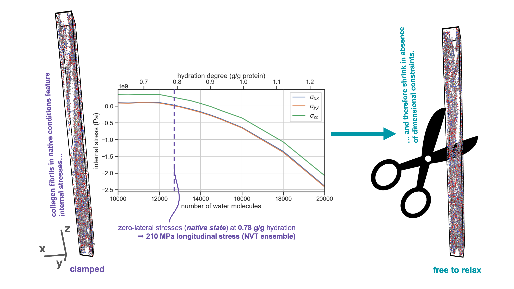

# MD simulations of collagen microfibril simulations
Molecular models (LAMMPS DATA files), thermodynamical data and workflows for LAMMPS simulations of hydration, relaxation and mechanical testing as well as post-treatment of thermodynamics of the systems.

## Associated publication
This repository is associated with the following publication: Steiakakis, K., Pichard, A., Vassaux, M. (2025). Molecular dynamics simulations reveal internal tension in native state collagen fibrils. [arXiv2511.14261](https://doi.org/10.48550/arXiv.2511.14261) 

## Content of the repository
- **hydration** contains the workflows, the final structures and the thermodynamical data of the simulation of the equilibration of the microfibril at different hydration level.
- **ambient-pressure** contains the workflow, the final structure and the thermodynamical data of the simulation of the relaxation at ambient-pressure of the microfibril.
- **laser-ablation** contains the workflow, the final structure and the thermodynamical data of the simulation of the laser-ablation at mid-span of the microfibril.
- **deformation** contains the workflows, the final structures and the thermodynamical data of the simulation of the application of mechanical deformation with varying lateral boundary conditions of the microfibril.
- **analysis** contains the Jupyter Notebook 'collagen_analysis.ipynb' for the analysis of the MD trajectories collagen model simulations using Python and the MDAnalysis library.

